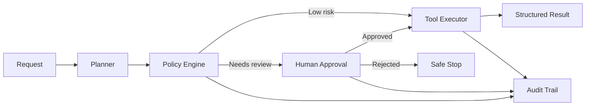

# Agentic AI Control Plane

A production-oriented reference implementation for AI agents that must operate safely inside real business workflows. The project separates planning, policy evaluation, human approval, execution, and audit logging so agent behavior remains observable and controllable.

## Why this exists

Agent demos often combine reasoning and execution in one opaque loop. That becomes risky when tools can change customer data, trigger payments, or communicate externally. This control plane demonstrates how to place deterministic guardrails around an otherwise probabilistic agent.

## Architecture



## Engineering features

- Explicit state machine rather than an unbounded autonomous loop
- Risk scoring and allow/deny/review policy decisions
- Human approval gates for consequential actions
- Idempotency keys to prevent duplicate execution
- Typed request, decision, and audit-event contracts
- Correlation IDs for end-to-end traceability
- FastAPI endpoints and health checks
- Container packaging and automated tests
- Model-independent design: connect OpenAI, Azure OpenAI, Anthropic, or local models behind the planner interface

## Quick start

```bash
python -m venv .venv
pip install -r requirements.txt
uvicorn main:app --reload
```

Run tests:

```bash
python -m unittest -v test_workflow.py
```

Example request:

```json
{
  "objective": "Summarize the account and prepare a customer follow-up",
  "requested_actions": ["read_crm", "draft_email"],
  "risk_score": 0.35
}
```

Adding `send_email` or a risk score above the configured threshold moves the workflow to `awaiting_approval` instead of executing automatically.

## Production extension points

- Persist workflow state in PostgreSQL or DynamoDB
- Dispatch tools through SQS, Temporal, or durable task queues
- Export traces and metrics through OpenTelemetry
- Add tenant-specific policy bundles and RBAC
- Evaluate planner quality against versioned scenario datasets
- Encrypt audit records and apply retention policies

## Repository boundaries

This is a synthetic reference implementation created to demonstrate architecture patterns. It contains no client code, credentials, data, or confidential prompts.

## License

MIT
